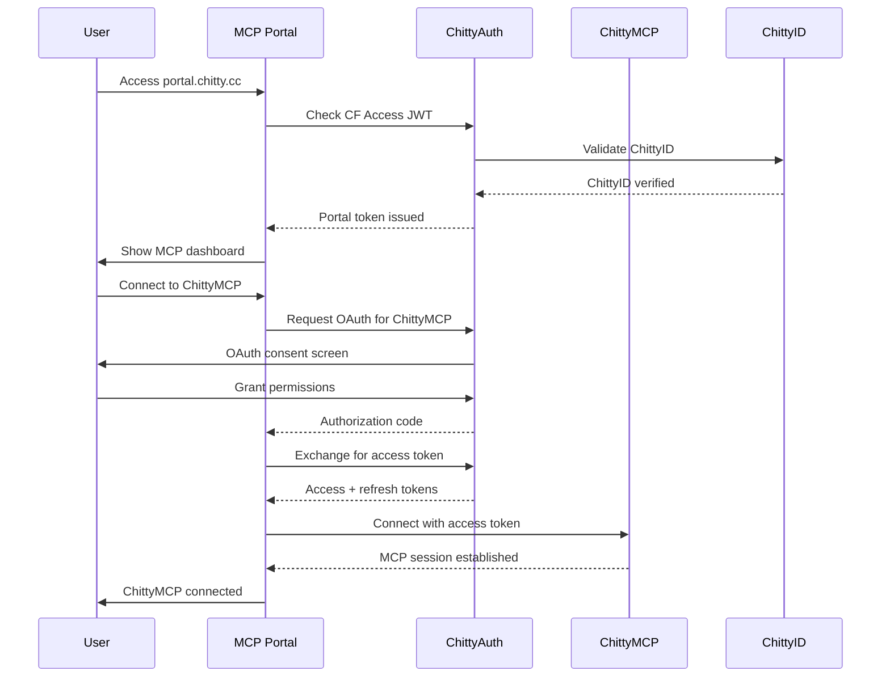

# ChittyMCP Portal Integration with ChittyAuth OAuth

## Overview

This document outlines the integration of cross-synced MCPs into the Cloudflare MCP Portal (account `bbf9fcd845e78035b7a135c481e88541`) with ChittyAuth managing OAuth flows and authentication.

## Architecture

```
┌─────────────────────────────────────────────────────────────────┐
│                 Cloudflare Account 121                         │
│                bbf9fcd845e78035b7a135c481e88541                 │
├─────────────────────────────────────────────────────────────────┤
│  🚪 MCP Portal (portal.chitty.cc)                              │
│  ├── Cloudflare Zero Trust Authentication                      │
│  ├── MCP Server Registry & Discovery                           │
│  └── Cross-Session State Management                            │
├─────────────────────────────────────────────────────────────────┤
│  🔐 ChittyAuth (auth.chitty.cc)                               │
│  ├── OAuth2 Authorization Server                               │
│  ├── JWT Token Management                                      │
│  ├── ChittyID Authority Integration                            │
│  └── MCP Portal Authentication Provider                        │
├─────────────────────────────────────────────────────────────────┤
│  🔄 Cross-Synced MCP Servers                                  │
│  ├── ChittyMCP Universal Server (mcp.chitty.cc)               │
│  ├── ChittyChat MCP (chat.chitty.cc)                          │
│  ├── ChittyRouter MCP (router.chitty.cc)                      │
│  └── Third-Party Integrated MCPs                              │
└─────────────────────────────────────────────────────────────────┘
```

## Integration Benefits

### 1. **Unified Authentication**
- Single sign-on across all MCP servers via ChittyAuth
- Cloudflare Zero Trust policies apply to all MCP access
- ChittyID-based identity management across the ecosystem

### 2. **Cross-Session Continuity**
- OAuth tokens persist across browser sessions and devices
- MCP state synchronization between local and cloud instances
- Seamless handoff between Claude Desktop and web-based MCP clients

### 3. **Enterprise Security**
- Centralized token management and revocation
- Audit trails for all MCP server access
- Role-based access control (RBAC) via ChittyID permissions

### 4. **Developer Experience**
- Single OAuth integration point for external applications
- Standardized MCP server discovery and registration
- Consistent authentication flow across all ChittyOS services

## Implementation Plan

### Phase 1: MCP Portal Setup

#### 1.1 Portal Infrastructure
```toml
# wrangler-portal.toml
name = "chitty-mcp-portal"
main = "src/portal.js"
account_id = "bbf9fcd845e78035b7a135c481e88541"
compatibility_date = "2024-09-23"

[[routes]]
pattern = "portal.chitty.cc/*"
zone_id = "bbf9fcd845e78035b7a135c481e88541"

# Service bindings to ChittyAuth
[[services]]
binding = "CHITTYAUTH_SERVICE"
service = "chittyauth"

[[services]]
binding = "CHITTYMCP_SERVICE"
service = "chittymcp"
```

#### 1.2 Portal Features
- **MCP Server Registry** - Discover and connect to available MCP servers
- **Authentication Dashboard** - Manage OAuth tokens and permissions
- **Session Management** - View active MCP sessions across devices
- **Access Control** - Configure user permissions and server access

### Phase 2: ChittyMCP Integration

#### 2.1 OAuth Client Registration
```javascript
// Register ChittyMCP as OAuth client with ChittyAuth
const mcpClientRegistration = {
  client_id: "chittymcp-universal-server",
  client_name: "ChittyMCP Universal Server",
  client_uri: "https://mcp.chitty.cc",
  redirect_uris: [
    "https://mcp.chitty.cc/oauth/callback",
    "https://portal.chitty.cc/mcp/chittymcp/callback"
  ],
  scopes: ["mcp:read", "mcp:write", "chittyos:services"],
  grant_types: ["authorization_code", "refresh_token"],
  token_endpoint_auth_method: "client_secret_basic"
};
```

#### 2.2 Cross-Sync Authentication
```javascript
// ChittyMCP OAuth middleware
class ChittyMCPAuthMiddleware {
  async authenticate(request) {
    const token = this.extractToken(request);

    // Validate token with ChittyAuth
    const validation = await this.chittyAuth.validateToken(token);

    if (!validation.valid) {
      // Redirect to MCP Portal for authentication
      return this.redirectToPortal(request);
    }

    // Store session for cross-sync
    await this.syncSession(validation.chitty_id, token);

    return validation;
  }

  async syncSession(chittyId, token) {
    // Store session in cross-sync registry
    await this.registry.storeSession({
      chitty_id: chittyId,
      access_token: token,
      mcp_server: "chittymcp",
      synced_at: new Date().toISOString(),
      devices: await this.getActiveDevices(chittyId)
    });
  }
}
```

### Phase 3: Portal Authentication Flow

#### 3.1 User Authentication Journey


#### 3.2 Cross-Device Synchronization
```javascript
// Portal session sync service
class PortalSessionSync {
  async syncAcrossDevices(chittyId) {
    const sessions = await this.getMCPSessions(chittyId);

    // Sync to all registered devices
    for (const device of await this.getDevices(chittyId)) {
      await this.pushSessionUpdate(device, {
        mcp_servers: sessions.map(s => ({
          server_id: s.server_id,
          capabilities: s.capabilities,
          last_sync: s.updated_at,
          access_token: s.access_token // Encrypted
        }))
      });
    }
  }

  async registerDevice(chittyId, deviceInfo) {
    return await this.devices.create({
      chitty_id: chittyId,
      device_id: deviceInfo.device_id,
      device_name: deviceInfo.name,
      client_type: deviceInfo.type, // "claude_desktop", "web", "mobile"
      registration_token: await this.generateDeviceToken()
    });
  }
}
```

### Phase 4: Enhanced ChittyMCP Integration

#### 4.1 MCP Server Registration
```javascript
// Auto-register with MCP Portal
export class ChittyMCPPortalClient {
  async registerWithPortal() {
    const registration = await fetch('https://portal.chitty.cc/api/v1/servers/register', {
      method: 'POST',
      headers: {
        'Authorization': `Bearer ${this.portalToken}`,
        'Content-Type': 'application/json'
      },
      body: JSON.stringify({
        server_id: 'chittymcp-universal',
        name: 'ChittyMCP Universal Server',
        description: 'Universal MCP server for ChittyOS services',
        version: '2.0.0',
        capabilities: this.getCapabilities(),
        endpoints: {
          mcp: 'https://mcp.chitty.cc',
          health: 'https://mcp.chitty.cc/health',
          oauth_callback: 'https://mcp.chitty.cc/oauth/callback'
        },
        tools: await this.getAvailableTools(),
        cross_sync_enabled: true
      })
    });

    return registration.json();
  }

  getCapabilities() {
    return {
      tools: 23,
      resources: true,
      prompts: true,
      sampling: false,
      notifications: true,
      cross_device_sync: true,
      oauth_integration: true,
      chittyos_native: true
    };
  }
}
```

#### 4.2 Cross-Sync State Management
```javascript
// Enhanced ChittyMCP with portal integration
export class ChittyMCPWithPortal extends ChittyMCP {
  async handlePortalSync(request) {
    const syncData = await request.json();

    // Validate sync token from portal
    const isValid = await this.chittyAuth.validateSyncToken(
      syncData.sync_token
    );

    if (!isValid) {
      return new Response('Invalid sync token', { status: 401 });
    }

    // Apply cross-device state
    await this.applyPortalState(syncData.state);

    // Return current server state
    return new Response(JSON.stringify({
      server_id: this.serverId,
      state: await this.getCurrentState(),
      tools: this.getAvailableTools(),
      synced_at: new Date().toISOString()
    }));
  }

  async applyPortalState(portalState) {
    // Merge portal state with local state
    const currentState = await this.getState();
    const mergedState = this.mergeStates(currentState, portalState);

    await this.setState(mergedState);

    // Notify portal of successful sync
    await this.notifyPortalSync(mergedState);
  }
}
```

## Portal Dashboard Features

### 1. **MCP Server Management**
- View all connected MCP servers
- Check server health and capabilities
- Enable/disable servers per user
- Configure server-specific permissions

### 2. **OAuth Token Dashboard**
- View active OAuth tokens
- Revoke tokens across all devices
- Token usage analytics
- Refresh token management

### 3. **Cross-Device Sessions**
- See active sessions across devices
- Force session synchronization
- Remote session termination
- Device management

### 4. **Access Control**
- ChittyID-based permissions
- Role assignment (admin, user, readonly)
- Server access policies
- Audit log viewer

## Security Implementation

### 1. **Token Security**
```javascript
// Secure token storage in portal
class PortalTokenManager {
  async storeToken(chittyId, tokenData) {
    const encryptedToken = await this.encrypt(tokenData.access_token);

    await this.kv.put(`tokens:${chittyId}:${tokenData.server_id}`, {
      access_token: encryptedToken,
      refresh_token: await this.encrypt(tokenData.refresh_token),
      expires_at: tokenData.expires_at,
      scopes: tokenData.scopes,
      created_at: new Date().toISOString()
    }, {
      expirationTtl: tokenData.expires_in
    });
  }

  async encrypt(data) {
    const key = await crypto.subtle.importKey(
      'raw',
      new TextEncoder().encode(this.encryptionKey),
      { name: 'AES-GCM' },
      false,
      ['encrypt']
    );

    const iv = crypto.getRandomValues(new Uint8Array(12));
    const encrypted = await crypto.subtle.encrypt(
      { name: 'AES-GCM', iv },
      key,
      new TextEncoder().encode(data)
    );

    return btoa(String.fromCharCode(...iv, ...new Uint8Array(encrypted)));
  }
}
```

### 2. **Access Control**
```javascript
// Portal access control middleware
class PortalAccessControl {
  async checkAccess(chittyId, resource, action) {
    // Check ChittyID permissions via ChittyAuth
    const hasPermission = await this.chittyAuth.checkPermission(
      chittyId,
      `portal:${resource}:${action}`
    );

    if (!hasPermission) {
      throw new Error(`Access denied: ${action} on ${resource}`);
    }

    // Check server-specific permissions
    if (resource.startsWith('mcp:')) {
      const serverId = resource.split(':')[1];
      return await this.checkMCPServerAccess(chittyId, serverId, action);
    }

    return true;
  }

  async checkMCPServerAccess(chittyId, serverId, action) {
    const serverPolicy = await this.getServerPolicy(serverId);
    const userRole = await this.getUserRole(chittyId);

    return serverPolicy.permissions[userRole]?.includes(action) || false;
  }
}
```

## Deployment Configuration

### 1. **Portal Deployment**
```bash
# Deploy MCP Portal to account 121
cd portal/
wrangler deploy --config wrangler-portal.toml

# Configure DNS
wrangler route add "portal.chitty.cc/*" --zone chitty.cc
```

### 2. **ChittyAuth Updates**
```bash
# Deploy updated ChittyAuth with portal support
cd chittyauth/
wrangler deploy --env production

# Update OAuth client registrations
npm run configure:oauth-clients
```

### 3. **ChittyMCP Integration**
```bash
# Deploy ChittyMCP with portal integration
cd chittymcp/
npm run deploy:portal-integrated

# Register with portal
npm run register:portal
```

## Benefits Summary

### For Users
- **Single Sign-On** - One authentication for all MCP servers
- **Cross-Device Sync** - Seamless experience across devices
- **Centralized Management** - Control all MCP access from one dashboard

### For Developers
- **Standardized OAuth** - Consistent integration pattern
- **Automatic Discovery** - MCP servers auto-register with portal
- **Enhanced Security** - Enterprise-grade authentication and authorization

### for ChittyOS Ecosystem
- **Unified Identity** - ChittyID-based access control
- **Centralized Audit** - All MCP access logged and monitored
- **Scalable Architecture** - Supports unlimited MCP servers and users

This integration creates a comprehensive enterprise MCP management platform with ChittyAuth as the OAuth provider and the MCP Portal as the central hub for all cross-synced MCP servers in the ChittyOS ecosystem.